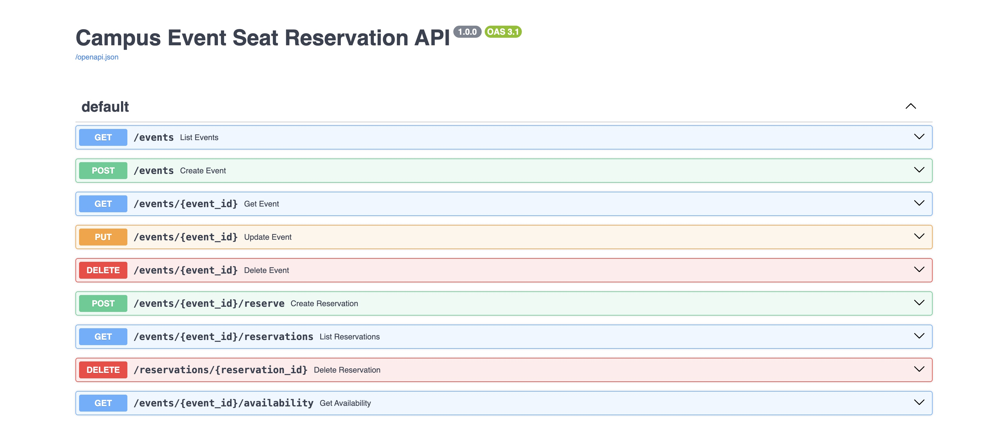
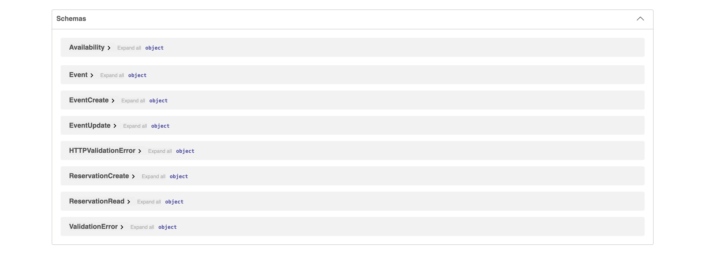
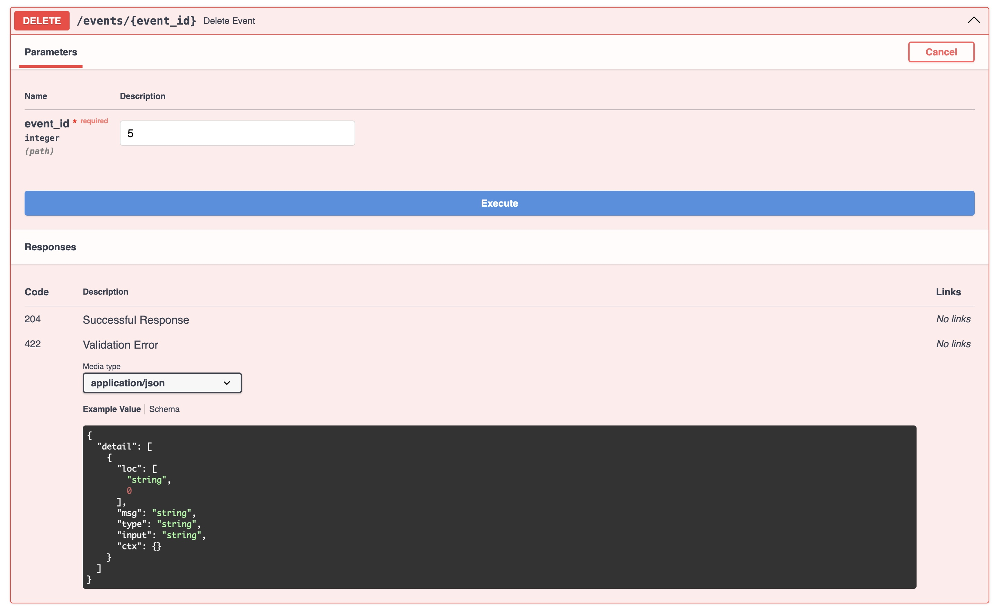

# Campus Event Seat Reservation API

## Project description

A REST API for managing college workshops, hackathons, seminars, and other campus events. Organizers can manage events, students can reserve or cancel seats, and clients can check seat availability.

## Technologies used

- Python 3.9+
- FastAPI for the REST API and interactive documentation
- SQLModel and SQLAlchemy for data models and database operations
- SQLite for local storage
- Pydantic and Email Validator for request validation

## Installation

Clone this repository and open a terminal in the project root. Create and activate a virtual environment:

```bash
python -m venv .venv
```

macOS/Linux:

```bash
source .venv/bin/activate
```

Windows PowerShell:

```powershell
.venv\Scripts\Activate.ps1
```

Install dependencies:

```bash
python -m pip install -r requirements.txt
```

## Run the FastAPI application

From the project root, run:

```bash
python -m uvicorn app.main:app --reload
```

The SQLite database and required tables are created automatically when the application starts.

## Swagger UI

Open **[http://127.0.0.1:8000/docs](http://127.0.0.1:8000/docs)** for the interactive Swagger UI. ReDoc is available at [http://127.0.0.1:8000/redoc](http://127.0.0.1:8000/redoc).

## Available endpoints

| Method | Path | Description |
| --- | --- | --- |
| `POST` | `/events` | Create an event. |
| `GET` | `/events` | List all events. |
| `GET` | `/events/{event_id}` | Get one event. |
| `PUT` | `/events/{event_id}` | Update an event. |
| `DELETE` | `/events/{event_id}` | Delete an event and its reservations. |
| `POST` | `/events/{event_id}/reserve` | Reserve a seat for an open event with space. |
| `GET` | `/events/{event_id}/reservations` | List reservations for an event. |
| `DELETE` | `/reservations/{reservation_id}` | Cancel a reservation. |
| `GET` | `/events/{event_id}/availability` | Show total, booked, and remaining seats. |

Requests validate positive capacity, non-empty names, email addresses, and `Open`/`Closed` event status. Missing records return `404`; closed/full events and capacity conflicts return `409`.

## Screenshots

Swagger UI endpoint list:



Swagger UI schemas:



Create event request:


Update event request:


Delete event request:


